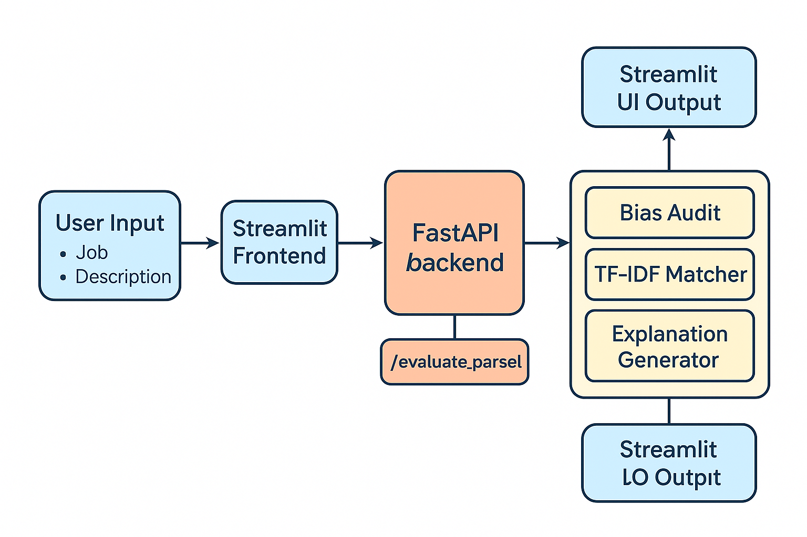

# 🧠 Talent Screening Engine

An AI-powered, bias-aware candidate screening engine for job matching.  
Built with FastAPI + Streamlit, this system ingests structured candidate profiles and job descriptions, evaluates match quality, flags potential bias, and provides transparent scoring explanations.
#### Tests
- 
- 


---

## 🚀 Features

- ✅ Match candidates to job descriptions using NLP (TF-IDF, SBERT-ready)
- ✅ Full bias audit: gender, age proxy, education prestige, location risk
- ✅ Explanation module shows matching keywords (✓/✗)
- ✅ RESTful API (FastAPI) with OpenAPI docs
- ✅ Visual UI (Streamlit) for easy use by recruiters or analysts
- ✅ Runs in a single Docker container with both API + UI

---

## 🧰 Tech Stack

| Component        | Tech                                |
|------------------|-------------------------------------|
| Backend API      | FastAPI                             |
| Frontend UI      | Streamlit                           |
| NLP/ML           | scikit-learn, sentence-transformers |
| Bias Audit       | gender-guesser, ruleset inference   |
| Containerization | Docker                              |
| Deployment       | Single command (`docker run`)       |

---

## 📦 Installation

### 🐳 Docker (Recommended)

```bash
docker build -t talent-screening .
docker run -p 8000:8000 -p 8501:8501 talent-screening
```
- API: http://localhost:8000/docs
- UI: http://localhost:8501

### 🧪 Local Dev (Manual)
```bash
# Setup
python -m venv venv
source venv/bin/activate
pip install -r requirements.txt

# Run API
uvicorn api.main:app --reload

# In separate terminal
streamlit run frontend/app.py
```

---

## 📤 API Endpoints

| Endpoint           | Method | Description                                     |
|--------------------|--------|-------------------------------------------------|
| `/evaluate_parsed` | POST   | Submit structured candidate profiles + job text |
| `/health`          | GET    | Health check (200 OK if alive)                  |
| `/version`         | GET    | API version + component info                    |

See Swagger UI at: http://localhost:8000/docs

---

## 📋 Data Model: `CandidateProfile`

```json
{
  "id": "uuid",
  "name": "Sarah Lee",
  "email": "sarah@example.com",
  "location": "Brooklyn",
  "education": ["MIT"],
  "experiences": ["Worked as backend dev for 3 years"],
  "skills": ["Python", "Django", "CI/CD"],
  "total_years_experience": 4.5,
  "job_titles": ["Backend Engineer"]
}
```

---

## 🧠 Architecture



---

> 👤 Author - Developed by Lidor ES

> 🛡 License - MIT


